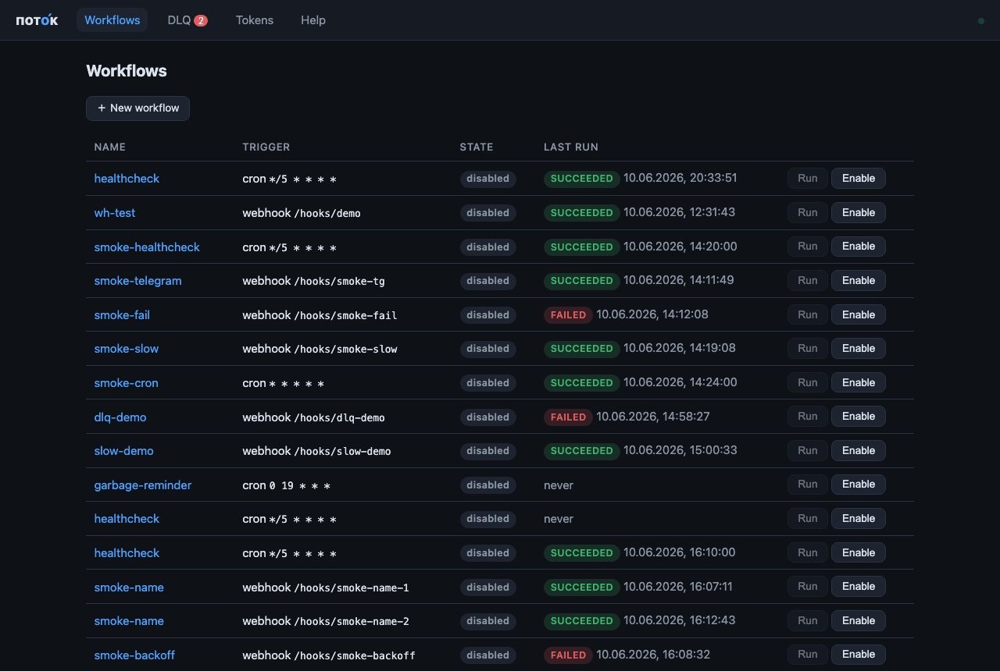
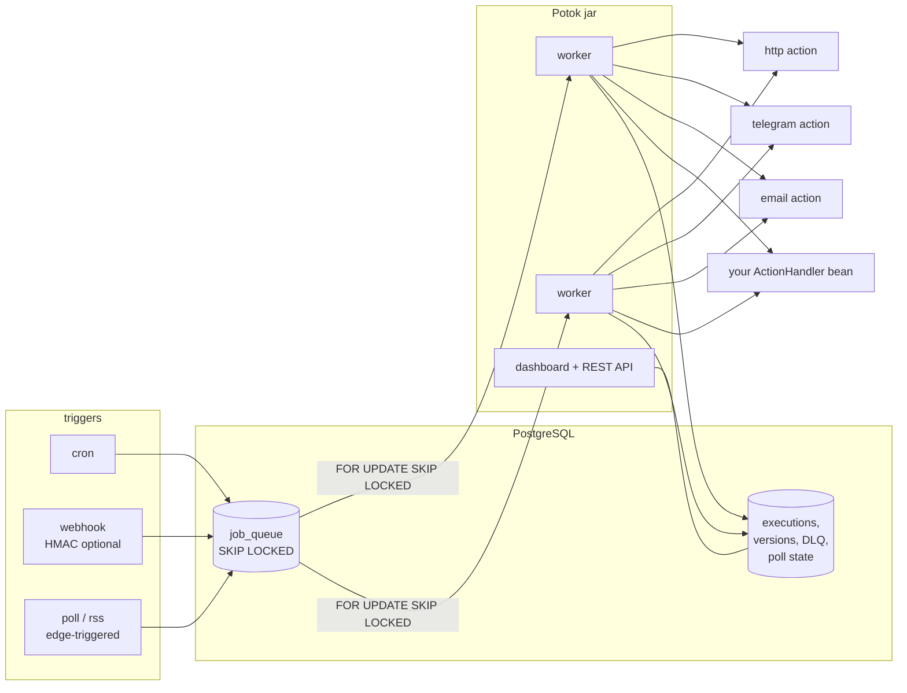

# потóк

[](https://github.com/AntonovYuriy/Potok/actions/workflows/ci.yml)
[](LICENSE)


**Potok** is a self-hosted workflow engine: triggers (cron, webhook, HTTP/RSS
pollers) start YAML-defined DAGs of steps that call HTTP APIs, deliver via
Telegram and email, or run your own actions. One Java service plus one PostgreSQL
database — the queue, the state, the history and the dedupe all live in
Postgres, so there is no broker to operate. A built-in dashboard (served from
the same jar, zero build step) covers editing, version history, executions,
the dead letter queue, API tokens and SMTP settings (password encrypted at rest).



## Quickstart

```bash
git clone https://github.com/AntonovYuriy/Potok.git && cd Potok
docker compose up -d
open http://localhost:8080            # dashboard; create a workflow in the editor
```

Or via API:

```bash
curl -s -H 'Content-Type: text/plain' --data-binary @examples/healthcheck.yaml \
     localhost:8080/api/workflows
```

## Use cases

Seventeen ready-to-use automations. Pick one in the dashboard (Help →
Examples), fill a short form — URL, threshold, schedule — hit Preview ▶ to
see what would happen right now, then Create. Full walkthroughs with sample
messages: [docs/use-cases.md](docs/use-cases.md).

| Case | Trigger | File |
|---|---|---|
| Remind me on a schedule (hello-world) | cron | [simple-reminder.yaml](examples/simple-reminder.yaml) |
| Remind me — and don't let it go | cron + durable `wait` | [follow-up-reminder.yaml](examples/follow-up-reminder.yaml) |
| Watch a number from any API | poll + jsonpath, edge-triggered | [json-threshold.yaml](examples/json-threshold.yaml) |
| Email me when a number crosses a line | poll + jsonpath → `email` | [email-alert.yaml](examples/email-alert.yaml) |
| Alert me on Telegram AND email at once | poll → parallel `telegram` + `email` | [multi-channel-alert.yaml](examples/multi-channel-alert.yaml) |
| Ask me before doing it (human-in-the-loop) | webhook + `approval` | [confirm-before-act.yaml](examples/confirm-before-act.yaml) |
| Get told when a page mentions something | poll + `contains()` | [keyword-on-page.yaml](examples/keyword-on-page.yaml) |
| Know when a price drops ("249,99 zł" parsed) | poll + css + `number: true` | [price-drop.yaml](examples/price-drop.yaml) |
| Never miss a recurring payment | monthly cron | [monthly-payment-reminder.yaml](examples/monthly-payment-reminder.yaml) |
| Get told when your site is down | cron + http | [healthcheck.yaml](examples/healthcheck.yaml) |
| Know when a project ships a new release | rss (GitHub releases.atom) | [release-watcher.yaml](examples/release-watcher.yaml) |
| Follow a feed in Telegram | rss, per-item dedupe | [rss-digest.yaml](examples/rss-digest.yaml) |
| Know the moment a page changes | poll + css extract | [availability-watcher.yaml](examples/availability-watcher.yaml) |
| Buy euros when they're cheap (NBP) | poll + jsonpath, edge-triggered | [price-alert.yaml](examples/price-alert.yaml) |
| Renew certificates before they expire | cron + `ssl_check` | [ssl-expiry.yaml](examples/ssl-expiry.yaml) |
| See repo pushes in Telegram | signed webhook (HMAC) | [github-notify.yaml](examples/github-notify.yaml) |
| Remember to put the bins out (Warsaw, runs in production; custom-action example) | cron + `warsaw_waste` | [garbage-reminder.yaml](examples/garbage-reminder.yaml) |

## Architecture



Workers are virtual threads claiming jobs with `SELECT … FOR UPDATE SKIP
LOCKED`; a `locked_until` lease doubles as crash recovery. Every step of every
execution is one queue row — parallel DAG branches are just multiple claimable
rows.

## YAML reference

```yaml
name: price-watch                  # unique among active workflows

trigger:                           # exactly one of cron | webhook | poll | rss
  cron: "0 19 * * *"               # 5-field crontab or 6-field Spring cron
  # webhook:
  #   path: "gh-events"            # → POST /hooks/gh-events
  #   hmac_secret_env: "GH_SECRET" # optional: require X-Hub-Signature-256 (see Security)
  # poll:                           # first poll runs immediately, then every interval
  #   interval: 5m
  #   http: { method: GET, url: "https://shop.example/api/item/42" }
  #   extract: { jsonpath: "$.price" }    # or { css: "span.price" } for HTML
  #   fire_when: "{{ poll.value < 100 }}" # expression (edge-triggered) or "changed"
  # rss: { interval: 15m, url: "https://hnrss.org/frontpage" }

steps:                             # a DAG; without `needs` steps run in file order
  - name: fetch
    action: http
    retry: { max_attempts: 5, base_delay: 10s, max_delay: 10m }   # optional
    with:
      method: GET
      url: "https://example.com/api"
      # headers: { Accept: application/json }
      # body: { any: json }
      # fail_on_status: false      # record non-2xx as success (healthcheck pattern)

  - name: notify
    needs: [fetch]                 # explicit dependencies; [] = root
    if: "{{ steps.fetch.status == 200 && exists(steps.fetch.body.message) }}"
    action: telegram
    with:
      # exactly one address: chat_id | to_recipient | to
      chat_id: "${TELEGRAM_CHAT_ID}"          # ${VAR} = environment variable
      # to_recipient: "Alice"                  # one approved recipient by name or id
      # to: "approved"                         # fan out to every APPROVED recipient
      text: "Result: {{ steps.fetch.body.message }}"
```

### DAG semantics

- `needs: [a, b]` — runs once ALL listed steps are satisfied. No `needs` =
  the previous step in the file (linear YAMLs just work); independent ready
  steps run **in parallel**.
- Validation at create/update (400 with a clear message): dependency cycles,
  unknown `needs`, template references outside the step's dependency closure.
- A step that exhausts retries fails the execution and poisons its downstream
  as `SKIPPED (dependency failed: X)`; **independent branches keep running**.
  A DLQ requeue revives the downstream too.
- A step SKIPPED by its own `if:` **counts as satisfied** for dependents.

### Conditions

Used in step `if:` and `poll.fire_when`. Grammar (parentheses group, `&&`
binds tighter than `||`):

```
expr   := or
or     := and ('||' and)*
and    := unit ('&&' unit)*
unit   := '(' expr ')' | a OP b | contains(x, y) | exists(path) | path
OP     := == | != | > | < | >= | <=
```

Operands: dot-paths (`steps.fetch.body.price`, `trigger.user`, `poll.value`),
numbers, `'strings'`, `true/false/null`. Comparison is numeric when both sides
are numbers, lexicographic otherwise. `contains` = substring or list
membership; `exists` = path resolves to non-null.

### Templating

`{{ path }}` interpolates into strings; a `with:` value that is exactly one
expression keeps its type. Context: `trigger.*` (webhook payload / poll
response / rss item), `steps.<name>.*` (outputs of dependencies only).
`${ENV_VAR}` substitutes environment variables at execution time.

### Retry

Exponential backoff with full jitter:
`delay = random(0, min(max_delay, base_delay × 2^(attempt−1)))` — defaults
3 attempts, base 10s, cap 10min. Exhausted ⇒ dead letter queue.

## Versioning

Every create/update appends to an immutable history (`workflow_version`);
executions pin the version they started with — editing a workflow never
changes what an in-flight execution does. Rollback creates a *new* version
with the old content. Versions are plain text and kept forever.

```
GET  /api/workflows/{id}/versions?page=&size=
POST /api/workflows/{id}/versions/{n}/rollback
```

## Security

**API tokens** — `POTOK_API_KEY` (env) is the bootstrap root key; further
tokens are managed at `/api/tokens` (or the Tokens page in the dashboard).
Plaintext is shown once; only SHA-256 hashes are stored; revocation is
immediate. All of `/api/**` accepts root key or any active token via the
`X-API-Key` header — except `POST /api/admin/purge`, which is root-only.

**SSRF guard** — `http` steps, pollers and previews call user-supplied URLs,
so Potok resolves the target host first and refuses loopback, private
(RFC1918), link-local (including the `169.254.169.254` cloud metadata
endpoint) and IPv6 unique-local addresses with a clear error. Self-hosting
Potok to automate your *own* internal services is a legitimate setup — set
`POTOK_ALLOW_PRIVATE_URLS=true` to turn the guard off, and understand the
trade-off: anyone who can create workflows on that instance can then probe
anything the server can reach. Honest limitations either way: the check runs
on the initial URL only (a redirect chain is not re-checked) and a DNS answer
that changes between check and request (DNS rebinding) is not caught.

**Webhook signatures** — set `trigger.webhook.hmac_secret_env: "MY_SECRET"`
and exports `MY_SECRET` on the server. Deliveries must then carry
`X-Hub-Signature-256: sha256=<hex HMAC-SHA256 of the raw body>` — exactly what
GitHub sends. Wiring a GitHub webhook: repo → Settings → Webhooks → payload
URL `https://your-host/hooks/<path>`, content type JSON, secret = the same
value as `MY_SECRET`. Invalid/missing signature → 401; comparison is
constant-time; unset env var fails closed.

## Dead letter queue

Exhausted jobs land in `dead_letter` with input + trigger snapshot.
`GET /api/dlq`, `POST /api/dlq/{id}/requeue` (reopens the execution, revives
dependency-skipped downstream), `DELETE /api/dlq/{id}`. Optional Telegram
alert: `POTOK_DLQ_TELEGRAM=true`, rate-limited to 1/min.

## Dashboard

Served from the jar at `/` — vanilla ES modules and hand-written CSS, no
build step, no CDN. Workflow list and detail, **YAML editor** with inline
validation errors, **version history with rollback**, execution step timeline
(durations, attempts, errors, outputs), DLQ ops, **API tokens** page.
Auth-aware: `/api/meta` (public) tells the UI whether to prompt for a key.
Open views poll every 7s.

**Preview — "what would happen right now".** Both the template form and the
YAML editor have a *Preview ▶* button: the workflow runs once, synchronously,
in dry-run mode. Read-only calls (http GET, the poll fetch, `ssl_check`,
`warsaw_waste`) execute for real; side effects don't — the Telegram message is
rendered and shown but **not sent**, non-GET http is reported as "would send
POST to …". Conditions are evaluated against live data ("NOT met right now —
current: 249"), poll triggers get a plain-language line about when they
actually fire, and nothing is persisted: no workflow, no execution, no poll
state. Limits: 10s wall clock, 10 steps, single attempt per step.

## Durable waits & approvals

A step can pause without holding anything in memory:

```yaml
  - name: pause
    wait: 3d            # durable sleep — a run_at timestamp in Postgres

  - name: ask
    action: approval     # human-in-the-loop
    with:
      text: "Deploy v2.3 to prod?"
      timeout: 6h        # absent -> 24h; silence counts as "no"
```

`wait` re-parks the step's queue job at `now + duration` — restarts and
deploys can't cancel it, because there is nothing running to kill. `approval`
sends ONE Telegram message with two **inline buttons**: a tap answers right
in the chat (toast + the message loses its buttons and shows the outcome) —
no browser involved. Under the hood the buttons carry one-time tokens (only
SHA-256 hashes are stored); a small `getUpdates` long-poller picks taps up
(`POTOK_TELEGRAM_POLL_UPDATES=false` switches the buttons to one-time links
instead — `POTOK_PUBLIC_URL` controls the link host). The approval parks the
step until a tap, a dashboard button, or the timeout. The decision becomes
the step's output — `{approved, timed_out}` — and downstream steps branch on
it with ordinary conditions: `if: "{{ steps.ask.approved == true }}"`.
A timeout is a **result**, never a failure: nothing retries, nothing hits
the DLQ. Waiting executions show up as a yellow WAITING badge in the
dashboard, with Approve/Deny buttons right on the step.

## Telegram recipients

Telegram routing has a directory: every chat that messages the bot is upserted
into `telegram_recipient` so workflows can address a person without hardcoding
chat ids. **Recipients receive bot messages; they do NOT gain access to
Potok.** The API and dashboard always stay behind `X-API-Key` / `api_token` —
talking to the bot can never grant control.

- `/start` registers the chat: PENDING (default) or APPROVED if
  `telegram_auto_approve` is on. `/stop` self-revokes. `/status` reports state.
- Recipients dashboard page lists everyone with Approve / Revoke / Re-approve /
  Delete actions and shows a Pending badge in the nav. The auto-approve toggle
  lives at the top of the same page (and on `PATCH /api/settings`).
- Telegram steps gain two additive addressing keys (the existing `chat_id`
  path is unchanged):

  ```yaml
    - name: notify
      action: telegram
      with:
        to: approved            # fan-out to every APPROVED recipient
        text: "Build #{{ trigger.build.number }} green"
  ```

  or one specific person:

  ```yaml
    - name: ping_alice
      action: telegram
      with:
        to_recipient: "Alice"   # uuid or display name
        text: "Your call"
  ```

  Only APPROVED recipients receive. For the **broadcast** (`to: approved`),
  PENDING and REVOKED recipients are silently skipped. For **`to_recipient`**,
  targeting a non-APPROVED chat (or an unknown name) **fails the step** with a
  clear error like `no approved recipient matches 'to_recipient': X (PENDING or
  REVOKED recipients never receive)` — fail-loud is intentional because a
  single named target is almost certainly a typo or stale config, not something
  to swallow. A broadcast step's output reports `sent_count`,
  `total_recipients`, and per-recipient failures; the step fails only if every
  send fails.
- The bot reads incoming messages via a single-instance `getUpdates`
  long-poller, guarded by a Postgres advisory lock so replicas don't race.
  Disable with `POTOK_TELEGRAM_POLL_UPDATES=false` (which also keeps approvals
  on URL buttons).
- **Auto-approve is OFF by default** because the bot's chat is discoverable:
  anyone who finds it would otherwise be subscribed automatically. Leave OFF
  and approve people deliberately in the dashboard, OR turn ON only for
  trusted, private bots.

## Per-workflow subscriptions

Recipients pick WHICH workflows they want. Default: nothing is offered —
you publish workflows into the menu explicitly.

1. **Publish a workflow** by setting `subscribable: true` at the top of the
   YAML, OR by toggling "Offer this workflow in the bot's /subscriptions menu"
   on its dashboard page (the dashboard toggle doesn't bump the version).

   ```yaml
   name: prod-deploys
   subscribable: true              # opt into the bot menu
   trigger: { webhook: { path: "prod-deploys" } }
   steps:
     - name: notify
       action: telegram
       with:
         to: subscribers           # fan-out to APPROVED subscribers of THIS workflow
         text: "🚀 prod {{ trigger.body.sha }} deployed"
   ```

2. **Subscribe** from Telegram: an APPROVED recipient sends `/subscriptions`
   to the bot. They get one inline-keyboard message — `✅ Name` for workflows
   they already follow, `⬜ Name` for the rest. Tapping a row toggles the
   subscription and the SAME message redraws with the new check-marks (no
   chat spam). PENDING chats get "waiting for approval"; REVOKED never gets a
   menu.

3. **Deliver** with `to: subscribers` in any telegram step. Only APPROVED
   subscribers of THAT workflow receive — PENDING/REVOKED filtered out, even
   if their `workflow_subscription` row still exists. Fan-out semantics match
   `to: approved`: per-recipient send, the step fails only if every send
   fails, `sent_count = 0` is a successful no-op (publish before anyone
   subscribes is fine). Output includes `audience` so you can tell broadcasts
   apart in the executions view.

4. **REST surface** for tooling and the dashboard:

   ```
   PATCH /api/workflows/{id}/subscribable    body: { "subscribable": true|false }
   GET   /api/workflows/{id}/subscribers     APPROVED subscribers only, masked chat ids
   ```

A workflow can be `subscribable: true` and still use `to: approved` or a
literal `chat_id` — the addressing keys are independent. The intended pairing
is `subscribable: true` + `to: subscribers`; the others are unchanged.

## REST API

| Method & path | Description |
|---|---|
| `POST /api/workflows` | create; body = raw YAML (`Content-Type: text/plain`) |
| `GET /api/workflows` · `GET /{id}` | list / detail (definition + YAML + current version) |
| `PUT /api/workflows/{id}` | update = new version; re-enables |
| `DELETE /api/workflows/{id}` · `POST /{id}/enable` | soft disable / enable |
| `POST /api/workflows/{id}/run` | manual run, 202 |
| `POST /api/preview` | dry run of a YAML body: real read-only fetches, simulated side effects, nothing persisted |
| `GET /api/workflows/{id}/versions` · `POST .../versions/{n}/rollback` | history / rollback |
| `POST /hooks/{path}` | webhook trigger (signature-checked when configured) |
| `GET /api/executions?workflowId=&page=&size=` · `GET /{id}` | history / step detail |
| `GET /api/dlq` · `POST /api/dlq/{id}/requeue` · `DELETE /api/dlq/{id}` | dead letters |
| `POST /api/tokens` · `GET /api/tokens` · `DELETE /api/tokens/{id}` | token management |
| `GET /api/recipients?status=&page=&size=` · `POST /{id}/approve` · `POST /{id}/revoke` · `DELETE /{id}` | telegram recipient directory |
| `GET /api/settings` · `PATCH /api/settings` | server-wide settings (today: `telegram_auto_approve`) |
| `PATCH /api/workflows/{id}/subscribable` · `GET /api/workflows/{id}/subscribers` | per-workflow telegram subscriptions (M7) |
| `POST /api/admin/purge` | run retention now (root key only) |
| `GET /api/meta` | public: app name, authRequired |

Errors are RFC 7807 `application/problem+json`.

## Integrate / API

If you're wiring another program to fire workflows or to manage them from
outside the dashboard, the developer-facing reference lives in
[docs/integration.md](docs/integration.md) and is rendered in the dashboard
under **Help → Connect & API** (`#/help/connect`). It covers the webhook
contract (`POST /hooks/{path}`, GitHub-compatible `X-Hub-Signature-256` HMAC
with bash / Python / Node snippets), the REST endpoint table, an
end-to-end token → workflow → run → poll walkthrough, error shapes, and the
limits that actually exist. Both surfaces serve the same Markdown asset, so
they cannot drift.

## Configuration (environment variables)

| Variable | Default | Purpose |
|---|---|---|
| `DB_URL` | `jdbc:postgresql://localhost:5432/potok` | Postgres JDBC URL |
| `DB_USER` / `DB_PASSWORD` | `potok` / `potok` | DB credentials |
| `PORT` | `8080` | HTTP port |
| `POTOK_API_KEY` | – | root API key; unset = auth off (local dev) |
| `TELEGRAM_BOT_TOKEN` / `TELEGRAM_CHAT_ID` | – | telegram action / examples |
| `POTOK_QUEUE_WORKERS` | `2` | concurrent workers (virtual threads) |
| `POTOK_QUEUE_LOCK_TIMEOUT` | `PT60S` | job lease; crash recovery horizon |
| `POTOK_QUEUE_RETRY_BASE_DELAY` / `_MAX_DELAY` | `PT10S` / `PT10M` | backoff shape |
| `POTOK_QUEUE_DEFAULT_MAX_ATTEMPTS` | `3` | default per-step attempts |
| `POTOK_SHUTDOWN_GRACE` | `PT20S` | in-flight budget on SIGTERM, then lease release |
| `POTOK_CRON_REFRESH_INTERVAL` | `PT30S` | trigger schedules re-read |
| `POTOK_RETENTION_DAYS` | `30` | nightly purge of finished executions |
| `POTOK_DLQ_TELEGRAM` | `false` | DLQ Telegram alerts |
| `POTOK_ALLOW_PRIVATE_URLS` | `false` | disable the SSRF guard (see Security) |
| `POTOK_PREVIEW_TIMEOUT` | `PT10S` | wall-clock budget for `/api/preview` |
| `POTOK_PUBLIC_URL` | `http://localhost:8080` | base URL for approval links in Telegram |
| `POTOK_TELEGRAM_POLL_UPDATES` | `true` | native button taps + recipient ingest via getUpdates; `false` = URL buttons, no auto recipient registration |
| `POTOK_LOG_JSON` | `false` | structured JSON logs |
| `POTOK_TELEGRAM_API_BASE` | `https://api.telegram.org` | Bot API base (tests/self-hosted) |

## Observability

`/actuator/prometheus`: `potok_queue_depth`, `potok_dlq_size`, execution
started/succeeded/failed counters, `potok_step_duration_seconds{action,outcome}`,
retry / action-failure / purge counters. Liveness and readiness probes
(readiness includes the DB). MDC `execution_id` + `workflow_name` on step logs.

## Design decisions

**Postgres as the queue, not a broker.** A workflow engine needs durable
state in a database anyway; putting the queue in the same Postgres means
exactly-one moving part, transactional handoff between "execution created"
and "job visible", and free backpressure. `FOR UPDATE SKIP LOCKED` gives
contention-free claims; the `locked_until` lease makes crash recovery a
predicate instead of a startup sweep. The trade-off — polling latency and
queue throughput bounded by Postgres — is the right one below thousands of
jobs/minute, which is this tool's territory.

**At-least-once, with idempotency where it's cheap.** Actions do external
I/O, so holding a transaction across them is off the table. Instead: the
lease guards the attempt, re-delivery after a crash is possible, and a step
that already SUCCEEDED is never re-run. Duplicate side effects are confined
to the rare lease-expiry window — documented, not hidden.

**Edge-triggered pollers.** A condition that *stays* true fires once, not
every 5 minutes — alerting people repeatedly about the same price drop trains
them to ignore alerts. State (`poll_state`, `rss_seen`) lives in Postgres and
commits in the same transaction as the execution start, so restarts neither
lose nor double fires. `extract` narrows change detection to the one value
that matters, immune to timestamp noise.

**DAG join dedupe via unique index.** When two parallel branches finish
simultaneously, both compute the join step as ready. Rather than a
coordinator, a unique index on `(execution_id, step_name)` plus
`ON CONFLICT DO NOTHING` makes the second enqueue a no-op — correctness from
the database, not from locks in application code.

**Embedded no-build UI.** The dashboard is vanilla ES modules served from the
jar: no node toolchain in CI, no CDN dependency at runtime, one artifact to
deploy. The cost (no framework conveniences) is acceptable at this UI size;
the benefit is that the UI can never be down, stale, or blocked by a build.

**Executions pin their definition.** Editing a workflow mid-run must not
change what running executions do, so each execution snapshots the parsed
definition and version at start. History is append-only; rollback appends.

## Deploying

Free-tier guide (Koyeb + Neon, from the GHCR image CI publishes):
[docs/deploy.md](docs/deploy.md). Multi-instance: job execution is safe at any
replica count (SKIP LOCKED); trigger schedulers dedupe via advisory locks and
cron claims — but the free tier is one instance anyway, and one instance is
the well-trodden path.

## Development

```bash
./gradlew test          # unit + integration (needs Docker for Testcontainers)
./gradlew bootRun       # against local postgres
```

Package-by-feature: `api`, `definition`, `trigger`, `execution`, `action`.
Adding an action = one Spring bean implementing `ActionHandler`; see
`WarsawWasteActionHandler` for a real-world example. More in
[CONTRIBUTING.md](CONTRIBUTING.md).

## Roadmap

Done: M1 linear engine → M2 reliability/observability → M3 auth, DAG,
pollers, dashboard → M4 editor, versioning, HMAC, tokens, extract.
Next (M5 candidates): multi-user/RBAC, workflow templates, SSE live updates
in the dashboard, richer actions. See [docs/roadmap.md](docs/roadmap.md).
