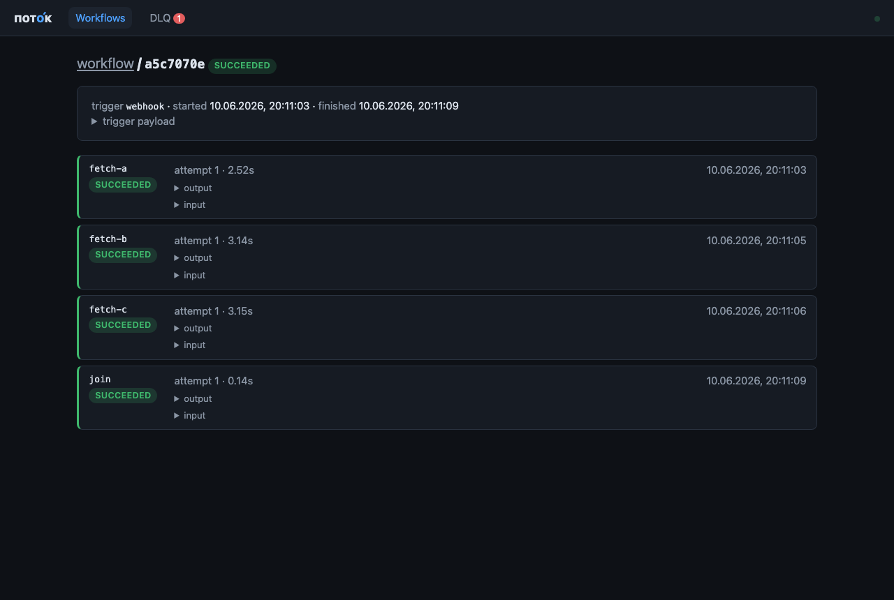

# Potok

[](https://github.com/AntonovYuriy/Potok/actions/workflows/ci.yml)

Self-hosted workflow engine. Define workflows in YAML (GitHub-Actions style):
a **trigger** (cron or webhook) starts a **linear chain of steps**, each step runs
an **action** (HTTP call, Telegram message). PostgreSQL is the only dependency —
it stores definitions, execution state, *and* the job queue
(`SELECT ... FOR UPDATE SKIP LOCKED`). No Kafka, no Redis, no UI. One container + one database.

```
            ┌──────────────┐      ┌────────────────┐      ┌─────────────────┐
 trigger ──▶│  REST API /  │─────▶│  job_queue     │─────▶│  workers        │
 (cron,     │  webhook     │ row  │  (postgres,    │ poll │  (virtual       │
  webhook,  └──────────────┘      │   SKIP LOCKED) │      │   threads)      │
  manual)                         └────────────────┘      └────────┬────────┘
                                                                   │ executes
                                                          ┌────────▼────────┐
                                                          │  actions (SPI)  │
                                                          │  http, telegram │
                                                          └─────────────────┘
```

## Quickstart

```bash
git clone <this repo> && cd potok
docker compose up -d
curl -s -H 'Content-Type: text/plain' --data-binary @examples/healthcheck.yaml localhost:8080/api/workflows
```

App: `http://localhost:8080`, health: `/actuator/health`, Postgres: `:5432`.
Telegram is optional — set `TELEGRAM_BOT_TOKEN` and `TELEGRAM_CHAT_ID` in the
environment before `docker compose up` to make `telegram` steps work; without a
token the step fails with a clear error message, nothing crashes.

Trigger a run manually and inspect it:

```bash
ID=$(curl -s -H 'Content-Type: text/plain' --data-binary @examples/healthcheck.yaml localhost:8080/api/workflows | jq -r .id)
EXEC=$(curl -s -X POST localhost:8080/api/workflows/$ID/run | jq -r .executionId)
curl -s localhost:8080/api/executions/$EXEC | jq
```

## YAML reference

```yaml
name: garbage-reminder          # unique workflow name (required)

trigger:                        # exactly one of cron | webhook | poll | rss (required)
  cron: "0 19 * * *"            # 5-field crontab or 6-field Spring cron
  # webhook: { path: "gh-events" }   # → POST /hooks/gh-events starts a run
  # poll:                            # poll an HTTP endpoint on a schedule
  #   interval: 5m
  #   http: { method: GET, url: "https://..." }
  #   fire_when: "changed"           # or an expression, e.g. "{{ body.price < 100 }}"
  # rss: { interval: 15m, url: "https://hnrss.org/frontpage" }

steps:                          # a DAG; without `needs` steps run in file order
  - name: fetch                 # unique step name (required)
    action: http                # action type (required)
    retry:                      # optional; all fields optional
      max_attempts: 5           # default 3
      base_delay: 10s           # first-retry cap; "500ms" / "10s" / "5m" / "PT10S"
      max_delay: 10m            # backoff ceiling
    with:                       # action inputs; values support templating
      method: GET
      url: "https://example.com/api"
      headers: { Accept: application/json }
      # body: { any: json }     # maps/lists are sent as JSON
      # fail_on_status: false   # record non-2xx as success so a later `if` can react

  - name: notify
    if: "{{ steps.fetch.status == 200 }}"   # optional condition; false → step SKIPPED
    needs: [fetch]                          # optional dependencies (see DAG below)
    action: telegram
    with:
      chat_id: "${TELEGRAM_CHAT_ID}"        # ${VAR} = environment variable
      text: "Завтра вывоз: {{ steps.fetch.body }}"
```

### DAG: needs and parallelism

- `needs: [a, b]` — the step runs once ALL listed steps finished successfully.
  Steps without `needs` depend on the previous step in the file (M1/M2 linear
  YAMLs run unchanged); the first step (or any step with `needs: []`) is a root.
- Independent ready steps run **in parallel** (bounded by `POTOK_QUEUE_WORKERS`).
- Cycles, unknown `needs`, and template references to steps outside the step's
  dependency closure are rejected with 400 at create/update time.
- Failure: a step that exhausts its retries marks the execution FAILED and its
  downstream steps SKIPPED (`dependency failed: X`); **independent branches keep
  running**. A DLQ requeue of the failed step un-skips its downstream.
- A step SKIPPED **by its own `if:` condition counts as satisfied** for
  dependents — they still run (use the condition on downstream steps too if a
  whole branch should stop).

### Conditions

`if:` and `poll.fire_when` accept one comparison or function call:

| Syntax | Notes |
|---|---|
| `a == b`, `a != b` | numeric when both sides are numbers, string otherwise |
| `a > b`, `a < b`, `a >= b`, `a <= b` | same numeric/string rule |
| `contains(haystack, needle)` | substring for strings, membership for lists |
| `exists(path)` | path resolves to a non-null value |

Operands: dot-paths (`steps.fetch.body.price`, `trigger.user`), numbers,
`'strings'`, `true/false/null`.

### Poll & RSS triggers

`poll` fetches a URL every `interval`; `fire_when: "changed"` starts an
execution when the response body hash changes (the first poll only records a
baseline). An expression (over `{status, body, headers}`) fires on its
**false → true transition** — edge-triggered, so a condition that stays true
fires once, not every poll. `rss` starts one execution per **new** feed item
(deduped by guid/link; first poll baselines existing items silently). Poller
state lives in Postgres and survives restarts; the trigger payload is the
polled response / feed item, available as `{{ trigger.* }}`. See
[examples/coin-watcher.yaml](examples/coin-watcher.yaml) and
[examples/rss-digest.yaml](examples/rss-digest.yaml).

### Templating

Minimal by design — no full expression language:

| Syntax | Meaning |
|---|---|
| `{{ trigger.user.name }}` | dot-path into the trigger payload (webhook JSON body) |
| `{{ steps.fetch.status }}` | dot-path into a previous step's output |
| `{{ a == b }}`, `{{ a != b }}` | comparison in `if:` conditions (numbers, 'strings', true/false/null) |
| `${ENV_VAR}` | environment variable substitution (empty when unset) |

A `with:` value that is exactly one `{{ … }}` keeps its original type
(numbers stay numbers, objects stay objects).

### Step outputs

`http` → `{status, headers, body}` (body parsed as JSON when possible).
`telegram` → `{status, chat_id}`.
`warsaw_waste` → `{tomorrow_date, tomorrow, tomorrow_count, summary, upcoming}` —
Warsaw (warszawa19115.pl) waste collection schedule for an `address_point_id`;
see [examples/garbage-reminder.yaml](examples/garbage-reminder.yaml) and the
handler source for a template of writing your own action.

## Execution semantics

- Steps run strictly in order; each step is one row in `job_queue`.
- **At-least-once** delivery with idempotency: a step that already SUCCEEDED
  for an execution is never re-run.
- Retry: exponential backoff with full jitter —
  `delay = random(0, min(max_delay, base_delay × 2^(attempt−1)))`,
  defaults base 10s / max 10min / 3 attempts; per-step `retry:` overrides
  (legacy top-level `max_attempts` still works).
- Exhausted retries → step FAILED → execution FAILED **and the job lands in
  the dead letter queue** with its input and trigger snapshot (see below).
- Crash recovery: claimed jobs hold a `locked_until` lease (60s); if a worker
  dies, the lease expires and any worker picks the job up again. Actions that
  outlive the lease can be delivered twice — that's the at-least-once contract.
- Graceful shutdown: on SIGTERM in-flight steps get `POTOK_SHUTDOWN_GRACE`
  (default 20s) to finish; remaining leases are released immediately so
  another instance continues without waiting out the lock timeout.
- Statuses: execution `PENDING → RUNNING → SUCCEEDED | FAILED`,
  step additionally `SKIPPED` (false `if:` condition).
- Workflow names are unique **among active workflows** only: soft-deleting a
  workflow frees its name for re-use; old executions keep pointing at the old
  workflow id.

## Dead letter queue

| Method & path | Description |
|---|---|
| `GET /api/dlq?page=&size=` | dead jobs, newest first (`items`, `total`) |
| `POST /api/dlq/{id}/requeue` | put the job back on the queue (attempts reset, execution reopened) |
| `DELETE /api/dlq/{id}` | drop the entry |

Optional alerting: `POTOK_DLQ_TELEGRAM=true` (with telegram configured) sends
a summary message when jobs enter the DLQ, rate-limited to one per minute.

## REST API

| Method & path | Description |
|---|---|
| `POST /api/workflows` | create workflow; body = raw YAML (`Content-Type: text/plain` or `application/yaml`); 201 + JSON |
| `GET /api/workflows` | list workflows |
| `GET /api/workflows/{id}` | one workflow with definition + YAML source |
| `PUT /api/workflows/{id}` | replace definition (raw YAML body), re-enables |
| `DELETE /api/workflows/{id}` | soft delete: `enabled=false`, history kept |
| `POST /api/workflows/{id}/run` | start an execution manually; 202 |
| `POST /hooks/{path}` | webhook trigger; JSON body becomes `trigger.*` payload; 202 |
| `GET /api/executions?workflowId=` | recent executions (latest 100) |
| `GET /api/executions/{id}` | execution with per-step status, input, output, error |

Errors are RFC 7807 `application/problem+json`. **No auth in M1** — put it
behind a reverse proxy or private network; auth is on the roadmap (M4).

## Configuration (environment variables)

| Variable | Default | Purpose |
|---|---|---|
| `DB_URL` | `jdbc:postgresql://localhost:5432/potok` | Postgres JDBC URL |
| `DB_USER` / `DB_PASSWORD` | `potok` / `potok` | DB credentials |
| `PORT` | `8080` | HTTP port |
| `TELEGRAM_BOT_TOKEN` | – | enables the `telegram` action |
| `TELEGRAM_CHAT_ID` | – | convention used by the examples via `${TELEGRAM_CHAT_ID}` |
| `POTOK_QUEUE_WORKERS` | `2` | concurrent queue workers (virtual threads) |
| `POTOK_QUEUE_POLL_INTERVAL` | `PT1S` | idle poll sleep |
| `POTOK_QUEUE_LOCK_TIMEOUT` | `PT60S` | job lease; crashed workers recover after this |
| `POTOK_QUEUE_RETRY_BASE_DELAY` | `PT10S` | backoff base (first-retry cap) |
| `POTOK_QUEUE_RETRY_MAX_DELAY` | `PT10M` | backoff ceiling |
| `POTOK_QUEUE_DEFAULT_MAX_ATTEMPTS` | `3` | default per-step attempts |
| `POTOK_SHUTDOWN_GRACE` | `PT20S` | in-flight step budget on SIGTERM |
| `POTOK_CRON_REFRESH_INTERVAL` | `PT30S` | how often cron schedules re-read the DB |
| `POTOK_TELEGRAM_API_BASE` | `https://api.telegram.org` | Bot API base (tests/self-hosted) |
| `POTOK_DLQ_TELEGRAM` | `false` | telegram alert when jobs enter the DLQ |
| `POTOK_LOG_JSON` | `false` | structured JSON logs (logstash encoder) |
| `POTOK_API_KEY` | – | enables X-API-Key auth for `/api/**` |
| `POTOK_RETENTION_DAYS` | `30` | nightly purge of finished executions older than this |

## Dashboard

A read-mostly web UI ships inside the jar — open `http://localhost:8080/`:
workflow list with last-run status, read-only YAML + paged execution history,
step timeline (durations, attempts, errors, output preview), DLQ with
requeue/delete. Ops from the UI: run, enable/disable. No YAML editing (M4).
Vanilla JS, no build step; open views auto-refresh every 7 seconds.



## Auth

Set `POTOK_API_KEY` and every `/api/**` call must carry the
`X-API-Key: <key>` header (401 problem+json otherwise). Unset = auth disabled
(local dev). Always open: `/` (dashboard assets), `/api/meta` (reports
`authRequired` so the UI knows to prompt; the key is kept in sessionStorage),
`/hooks/**` and actuator endpoints. Webhook signatures and per-user tokens are
M4 scope.

## Observability

`/actuator/prometheus` (Micrometer), `/actuator/health/liveness`,
`/actuator/health/readiness` (includes the DB check). Metrics:

| Metric | Type | Notes |
|---|---|---|
| `potok_queue_depth` | gauge | rows in job_queue |
| `potok_dlq_size` | gauge | rows in dead_letter |
| `potok_executions_started_total` | counter | |
| `potok_executions_succeeded_total` | counter | |
| `potok_executions_failed_total` | counter | |
| `potok_step_duration_seconds` | timer | tags: `action`, `outcome` |
| `potok_step_retries_total` | counter | rescheduled attempts |
| `potok_action_failures_total` | counter | tag: `action` (http, telegram, …) |
| `potok_dlq_added_total` | counter | jobs dead-lettered |
| `potok_purged_total` | counter | executions removed by retention |

Logs: plain text by default; `POTOK_LOG_JSON=true` switches to structured
JSON with `execution_id` and `workflow_name` MDC fields in step processing.

## Deploying

Free-tier guide (Koyeb + Neon, from the GHCR image CI publishes):
[docs/deploy.md](docs/deploy.md).

## Development

```bash
./gradlew test          # unit + integration (needs Docker for Testcontainers)
./gradlew bootRun       # against a local postgres (see DB_URL default)
```

Package-by-feature layout, single module: `api` (REST), `definition`
(YAML/templating/storage), `trigger` (cron, webhook), `execution`
(queue, workers, retry), `action` (SPI + handlers).

### Adding an action

Implement one Spring bean — discovery is automatic:

```java
@Component
class SlackActionHandler implements ActionHandler {
    public String type() { return "slack"; }
    public StepResult execute(StepContext ctx) { ... }
}
```

## Roadmap

- **M1 (this)** — linear workflows, cron + webhook triggers, http + telegram
  actions, Postgres queue, REST API, Docker.
- **M2** — DAG execution (needs/parallel branches), richer conditions,
  more actions (Slack, email, shell), per-step timeouts.
- **M3** — pluggable queue backends (Kafka/Rabbit) behind the queue interface,
  horizontal worker scaling, metrics + tracing.
- **M4** — web UI, API auth (tokens), multi-tenancy, secrets management.

See [docs/roadmap.md](docs/roadmap.md) and [docs/handoff.md](docs/handoff.md)
for the current state and next steps.
